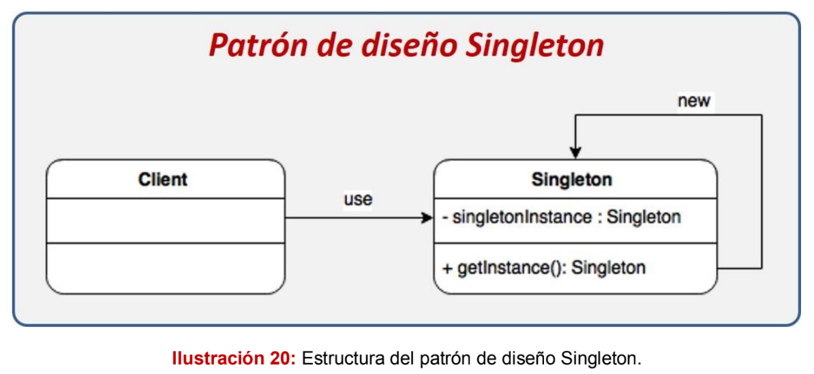
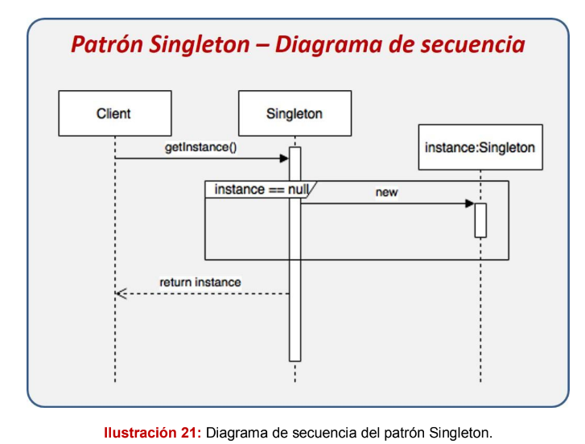
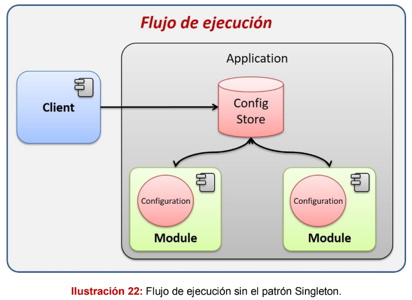
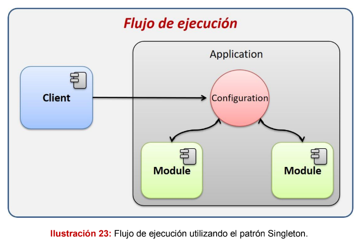

# Patrón Singleton

El patrón de diseño Singleton (soltero) recibe su nombre debido a que sólo se
puede tener una única instancia para toda la aplicación de una determinada clase,
esto se logra restringiendo la libre creación de instancias de esta clase mediante
el operador new e imponiendo un constructor privado y un método estático para
poder obtener la instancia.

La intención de este patrón es garantizar que solamente pueda existir una única
instancia de una determinada clase y que exista una referencia global en toda la
aplicación.

## Diagrama de secuencia

El diagrama se interpreta de la siguiente manera:
1. El cliente solicita la instancia al Singleton mediante el método estático
   getInstance.
2. El Singleton validará si la instancia ya fue creada anteriormente, de no
   haber sido creada entonces se crea una nueva.
3. Se regresa la instancia creada en el paso anterior o se regresa la
   instancia existente.
   Como podemos ver en el diagrama, sólo una instancia será creada, cuando el
   cliente solicite la creación, éste regresará la instancia que fue creada
   anteriormente y en caso de no existir creará la única instancia que existirá en la
   aplicación.

# Escenario
Se ha solicitado crear una aplicación que, como parte de su
proceso de inicio, cargue la configuración guardada en un archivo de propiedades,
esta configuración deberá estar disponible para toda la aplicación incluyendo los
módulos que ésta podría tener. Dicha configuración tiene un requerimiento
especial y es que deberá existir un solo objeto de configuración en toda la
aplicación, en la cual, todos los módulos puedan interactuar, de tal manera que si
un módulo afecta alguna propiedad de la configuración el resto del módulo lo
pueda ver reflejado.

En este caso la instancia se repite para cada módulo y no es lo que se requiere.

# La solución:
Para resolver el problema de la configuración, utilizaremos el patrón de diseño
Singleton, el cual nos permitirá controlar la forma en la que creamos un objeto
de configuración, el patrón de diseño limitará la creación de este objeto a una
única instancia para toda la aplicación; de esta manera, cuando un módulo quiera
obtener el objeto de configuración, éste recibirá la misma instancia que el resto
de módulos.

